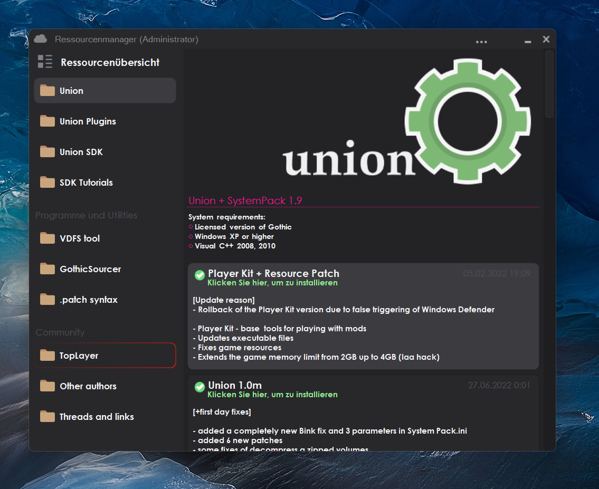

# BatteryEngine

https://www.flaticon.com/free-icon/battery_3165660?term=battery&page=1&position=31&page=1&position=31&related_id=3165660&origin=search

```
sudo apt install git cmake build-essential libx11-dev
```

https://google.github.io/styleguide/cppguide.html

https://github.com/zserge/tray -> modified for use with modern C++

https://github.com/CLIUtils/CLI11 -> BSD-Clause, modified to use Battery::FS::ifstream instead of std::ifstream

https://github.com/agauniyal/rang -> Unlicensed

https://github.com/Neargye/semver -> MIT License

https://github.com/cpm-cmake/CPM.cmake -> MIT License

https://github.com/Soundux/traypp -> MIT License

https://www.reichwein.it/unicode/ -> CC0 1.0 Universal (Like MIT)

https://github.com/JuliaStrings/utf8proc -> MIT "expat"

TODO: Add unit testing

TODO: Add pipelines and automate testing

TODO: Fix build system and the dependency problem (what includes what and what the examples need)

TODO: Setup examples so that they have their own copy of battery

TODO: Properly implement install scripts for installing the CMake library and the resulting binaries

TODO: Check support for network drives (filesystem)

TODO: Allow battery_embed() CMake command take absolute paths

Inspiration:



# License

Battery is licensed under the Apache License 2.0.  
Here is the original author's interpretation.  
You ARE allowed to:
 - Use the library and all provided tools for any purpose personally or commercially ✅
 - Modify them, as long as the license remains unchanged and all modifications are clearly marked ✅
 - Distribute any software freely that depends upon battery as a dependency or is statically linked ✅
 - Distribute battery in source or binary form while retaining the license ✅

But you are NOT allowed to:
 - Redistribute battery itself or large portions of it, claiming you are the original author ❌
 - Battery is distributed without any warranty whatsoever ❌
